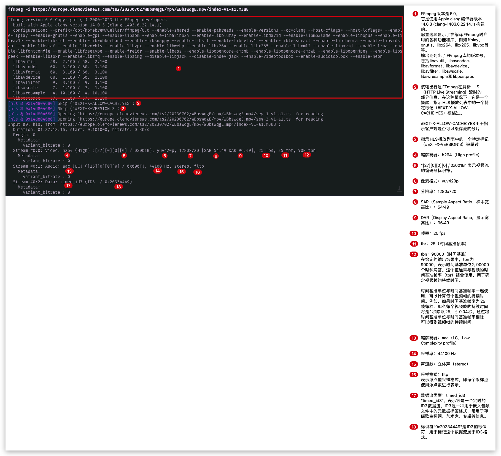

# ffmpeg-tips

#### 0、使用 Homebrew 安装 
```
# 安装
brew install ffmpeg

# 查看版本号
ffmpeg -version

# 升级
brew upgrade ffmpeg
```


#### 1、播放在线视频

直接播放視頻
```
ffplay [视频链接]
```

播放需要带header的视频，例：带token
```
ffplay -headers "KEY:VALUE" [视频链接]
```
#### 2、获取第一帧
在线视频第一帧
```
ffmpeg -i [视频链接] -vframes 1 -f image2 [输出图像文件]
```
本地视频第一帧
```
ffmpeg -i [输入视频文件] -vframes 1 -f image2 [输出图像文件]
```

#### 3、查看视频信息
```
ffmpeg -i [视频地址]
```
信息解释对照图



#### 4、提取音频
```
ffmpeg -i input.mp4 output.mp3
```

#### 5、用 ffmpeg 将视频切割为5秒的片段
```
ffmpeg -ss 00:00:10 -i input.mp4 -c copy -map 0 -segment_time 00:00:05 -f segment output%03d.mp4
```
#### 6、从ts文件中提取第一帧图片

```
ffmpeg -i input.ts -vframes 1 output.jpg
```


